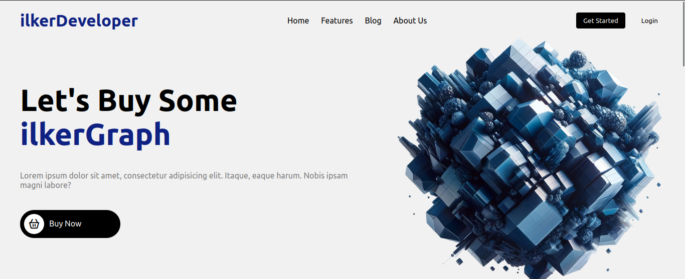
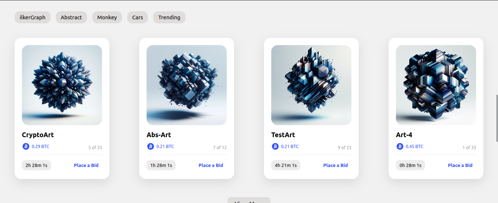

# Responsive NFT Website

Harika renk temasına sahip, tamamen duyarlı bir NFT Web Sitesi oluşturmak için modern HTML ve CSS'yi nasıl kullanacağınızı size göstereceğim. Duyarlı tasarımımız için CSS Flexbox, Medya sorgularını ve harika animasyon efektleri için CSS geçişini kullanacağız. Bu projede NFT Pazaryeri, En Çok Satanlar, Garanti, Alt Bilgi, Gezinme Çubuğu ve Başlık bölümü bulunur😉

# Screenshot
Here we have project screenshot :

#

